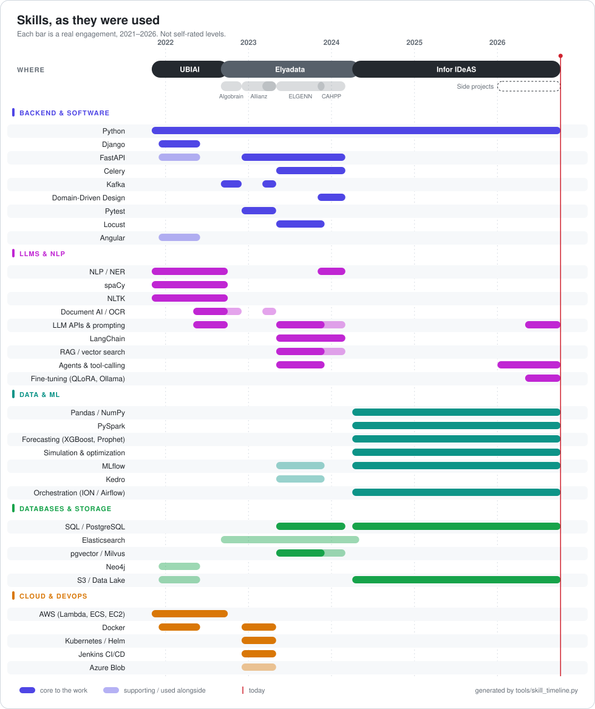

  

 

 

 

 

  
  
  

<h1 align="left">Hi, I am Khaled Adrani </h1>
<h3 align="left">Forward Deployed Engineer | Data Scientist | ML &amp; Backend Engineer </h3>

  <em>
    Hello, I am Khaled Adrani, a Computer Science Engineer from <a href="http://www.enicarthage.rnu.tn/"> <b>the National Engineering School of Carthage</b>, Tunisia</a>.  
    I operate as a Forward Deployed Engineer: I embed directly with clients, turn ambiguous business problems into shipped technical systems, and own the full loop from proof-of-concept to production.  

   That's the actual shape of my work:
<ul> 
    <li>Closing PoCs into signed contracts and presenting results directly to executives</li>
    <li>Building both the data science and backend systems behind international client engagements — pricing, forecasting, and inventory optimization</li>
    <li>Understanding business logic across domains (Healthcare, Scientific, Finance) and translating it into Functional/Non-Functional requirements</li>
    <li>Choosing the right architecture for the problem: Monolithic, Microservices, Event-Driven, Domain-Driven Design, Hexagonal...</li>
    <li>Writing and reviewing code to Industry standards and SOLID principles — readability first</li>
    <li>A high capacity to learn and adapt to new requirements and new technologies</li>
</ul>

       
  Want to discuss creative ideas? Or having a request? Contact me!
    
  </em> 
 

  

# SKILLS

  <picture>
    <source media="(prefers-color-scheme: dark)" srcset="./assets/skill-timeline-dark.svg">
    
  </picture>

<b>Also worked with</b> (not tied to a dated engagement)

 

# PERSONAL PROJECTS

- **Local coding agent CLI** (2026, ongoing): local-first ReAct agent over Ollama with a model-agnostic backend layer and a plan / execute / replan loop.
- **Local LLM fine-tuning** (2026, ongoing): QLoRA fine-tune of Qwen3-8B, served through Ollama as a drop-in for a structured-output classification task.

---

[Khaled Adrani](https://github.com/khaledadrani)

Last Edited on: 10/04/2026
